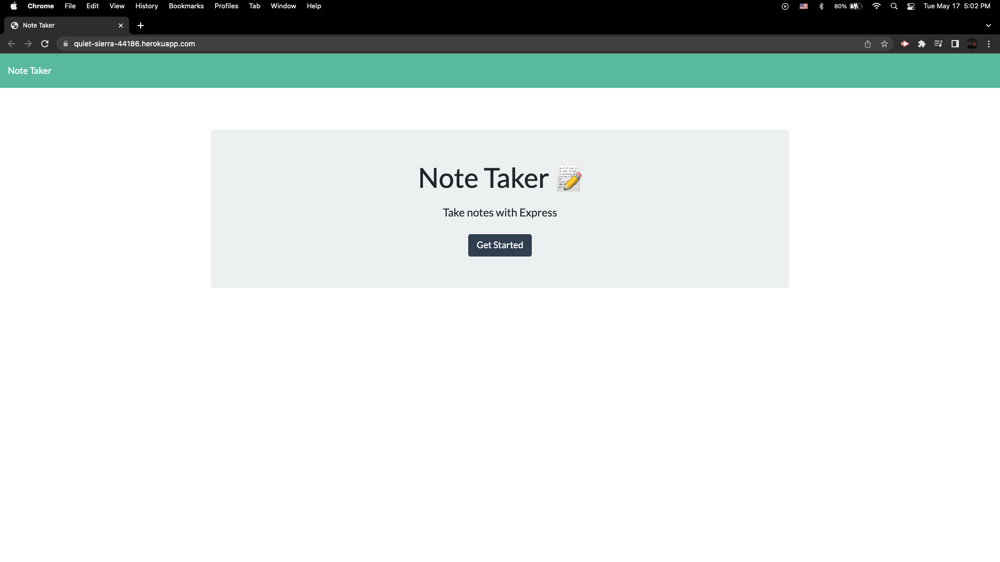
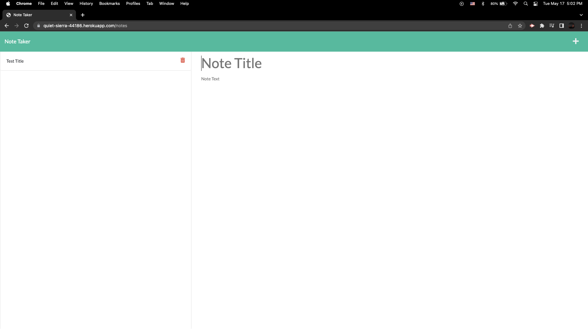
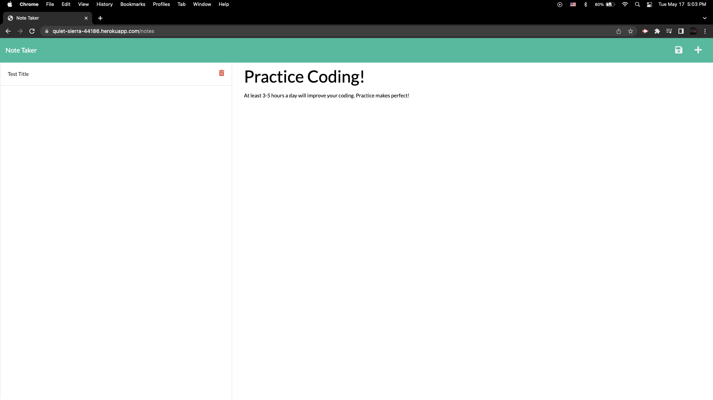
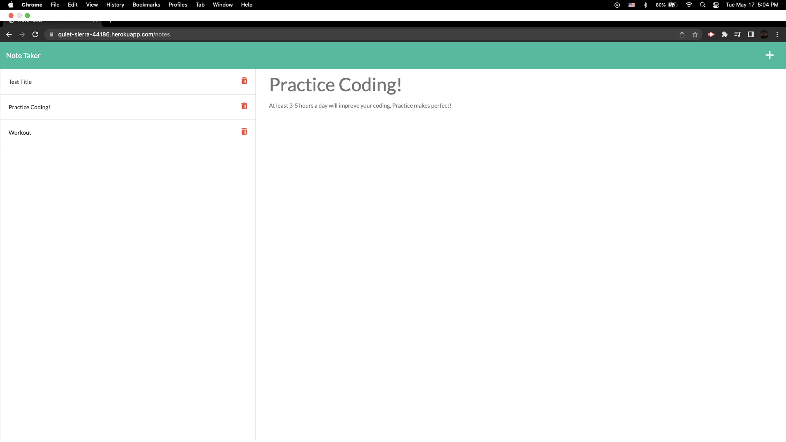
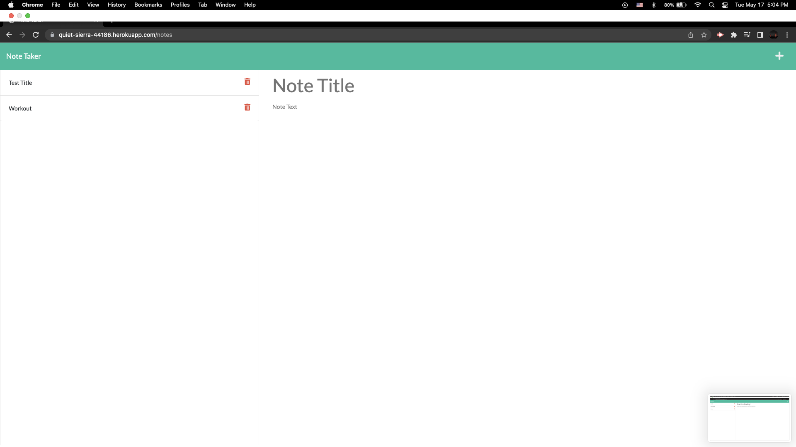

# Homework 11: Note Taker

## Description

With starter code provided, we were assigned to code the back-end part of this application to be able to write and save notes, and deploy the whole application on Heroku.

## Installation

As this is not a deployed application, use the Heroku link to be able view it on your brower:
- [Deployed](https://quiet-sierra-44186.herokuapp.com/)

Here is my GitHub Repo link:
- [GitHub Repo](https://github.com/jasonchun7/hw-11-note-taker)

## Usage

After clicking on the Deployed link, you're displayed with the landing page of the application:

Once you click the Get Started button, you're able to write your notes:

Here, you write the topic of your note and detailed comments:

You are then able to save your notes from the save button on the top right, and will be displayed in rows on the left:

If you've completed a task, you can delete the note from the red trash bin icon:

## Credits

Once again, our Instructor (Trey) took the time to walk us through the coding of the back-end after class, and gave us very detailed explanation of each step. Some code were too confusing and advanced, but Trey took the time to answer everyone's questions accordingly!

